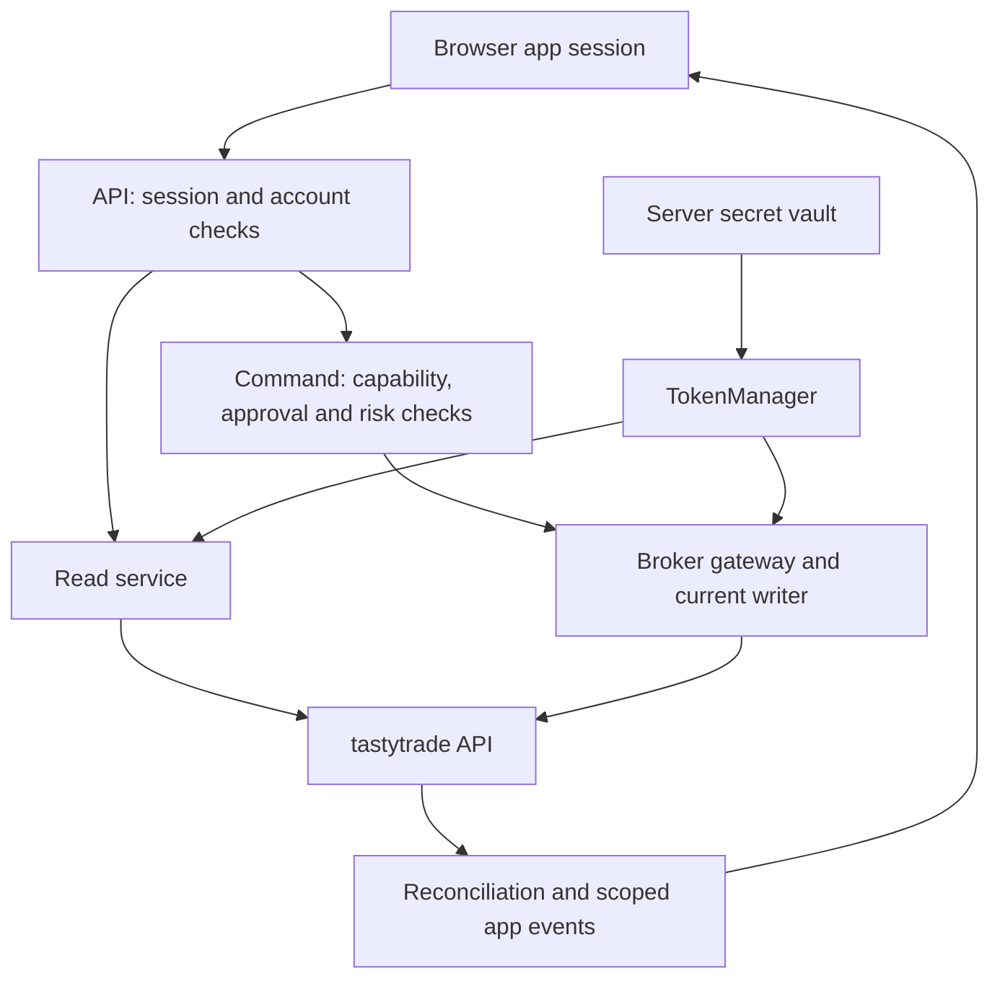

# Authentication walkthrough

Reviewed October 6, 2026, against the files imported from Trading System Design Pack revision 1. The repository was empty before this import. Local application code has not been supplied, so none of the planned controls below can yet be credited as implemented.

## What exists today

The [pack README](design-pack/00_README.md) identifies these assets as a design handoff. The [HTML prototype](design-pack/04_Trade_Workbench_Screens.html) contains local JavaScript, synthetic account data and simulated UI actions. Inspection found no `fetch`, `XMLHttpRequest`, `WebSocket` or `EventSource` calls, external script imports, or browser token storage. Its connection and permission displays demonstrate intended UI states.

The [SQL file](design-pack/05_database.sql) is a starter migration, the [proposal schema](design-pack/06_trade_proposal.schema.json) validates document shape, and the [API contracts](design-pack/03_API_and_Event_Contracts.md) contain proposed routes and pseudocode. There is no backend authentication implementation in this import.

## Three separate decisions

1. **App authentication:** who is using the workbench? The design calls for authenticated sessions, revocation, and 2FA/passkeys where available. It does not select an identity provider, session library, cookie configuration, or login implementation.
2. **Broker authentication:** which tastytrade grant may this backend use, in which environment and with which scopes? The planned TokenManager obtains broker access tokens using server-held credentials.
3. **Action authorization:** may this identified user or worker perform this operation on this account now? A broker token alone does not approve a trade. The application must also enforce capabilities, account access, immutable approvals, risk limits, freshness and execution mode.

Connecting GitHub to import this repository grants none of these application or brokerage permissions.

## Planned components and their evidence

The paths in this table come from the [implementation handoff](design-pack/11_Implementation_Handoff.md); they are future module locations, not existing directories.

| Component | Planned responsibility | Evidence in the imported pack |
|---|---|---|
| `services/trading/api/` | Validate app sessions; enforce account and capability access on HTTP and event requests | API contracts sections 1, 3 and 4; blueprint section 16.5 |
| Identity and policy service | Users, sessions, capabilities, approvals and strategy activation | Blueprint sections 5 and 6.2 |
| `services/trading/broker/` TokenManager | Environment-bound OAuth; expiry tracking; one refresh in flight per credential set | Blueprint section 3.1; backlog task CAP02 |
| Secret service and worker identities | Encrypted credentials; least-privilege access; separate environment identities | Blueprint sections 16.1 and 16.5; backlog task OPS01 |
| `services/trading/risk/` | Account policy, exact-payload authorization and aggregate risk reservations | Blueprint sections 5, 11 and 12; SQL `authorizations` |
| Broker gateway and execution writer | Exclusive ownership of broker mutation credentials and controlled dispatch | Blueprint section 11.4; API contracts section 5 |
| Backend market/account streams | Authenticate provider connections; normalize and permission-filter browser updates | Blueprint section 3.3; API contracts section 4 |
| `services/trading/ai/` | Account-scoped research/read/draft tools; no direct broker write authority | Handoff rule 8; blueprint section 9 |

## Intended request flow



This is the specified architecture. It is not an execution trace from running software.

**Read:** the browser requests an application route such as `GET /v1/accounts/{id}/snapshot`. The API authenticates the app session and checks access to that internal account ID. The service returns the authorized normalized snapshot; backend ingestion or reconciliation uses the broker adapter and TokenManager when provider data is required. Broker account numbers remain behind the server mapping. A cached read need not make a broker request every time.

**Command:** app authentication and capabilities are followed by validation, approval, reservation, and preparation of an immutable command. The proposed `/authorize` and `/dispatch` routes separate approval from dispatch. The gateway checks the current writer and current dispatch conditions before sending a broker request. The contracts contain this illustrative code:

```python
async def dispatch(intent_id, authorization_id):
    prepared = await prepare_with_account_lock(intent_id, authorization_id)
    await gateway.assert_current_writer(prepared.account_id, prepared.fence)
    await assert_current_dispatch_conditions(prepared)
    await record_submit_started(prepared)
    # Then submit once and reconcile acknowledgment, rejection or uncertainty.
```

This excerpt is from [API contracts section 5](design-pack/03_API_and_Event_Contracts.md#5-writer-pseudocode), with comments shortened. The surrounding pseudocode retains risk reservations and reconciles uncertain outcomes; it does not blindly retry a financial submission. The named functions do not exist as implemented source files here.

**Events:** the proposed `GET /v1/events` feed validates app access and filters by account/environment. It forwards normalized updates, not broker headers or tokens. Browser reconnects use a durable event cursor or a snapshot resynchronization.

## Credentials and tokens

| Item | Intended handling | What is present now |
|---|---|---|
| Brokerage password | Entered at the broker; the app must not collect it | Design requirement only |
| OAuth client secret and refresh token | Encrypted server secret service; limited worker access; excluded from logs/prompts/browser payloads | TokenManager and vault are unimplemented |
| OAuth access token | Backend adapter uses it; tracks expiry; coordinates refresh | No token cache or refresh code |
| Market quote token | Backend obtains it for the market-data connection | No implemented market connection |
| App session | Separate user identity/session lifecycle with revocation and command CSRF protection | No chosen provider, cookies, session store or middleware |
| Trade authorization | Durable account-bound policy/payload approval with expiration and revocation | Starter SQL and proposed API only |
| Writer fencing token | Monotonically increasing concurrency marker to exclude stale writers | SQL column; not a login or bearer credential |
| OpenAI credentials | No integration exists; implement as backend-only provider secrets under the same secret-management policy | Key loading, rotation and access policy still need implementation |

The database stores a **reference to a secret**, not a credential value:

```sql
CREATE TABLE accounts (
    -- other fields omitted
    credential_vault_reference text
);
```

In [the actual SQL](design-pack/05_database.sql), that column is nullable. It does not create a vault, encrypt data, or validate ownership. `owner_id` and authorization `user_id` have no accompanying users table or app-session implementation. Database permissions, tenant isolation and application checks remain work to do.

`authorizations` records the account, user, policy version, optional payload hash, authority envelope, `expires_at` and `revoked_at`. Those fields describe trading permission. The SQL alone does not verify that a request has a valid app session, enforce every authorization condition, or produce the signed authorization mentioned by the route contract.

## Broker documentation cross-check

The official [OAuth guide](https://developer.tastytrade.com/docs/authentication/oauth2/) was checked on October 6, 2026. It documents separate production/certification credentials, required `User-Agent` headers, and 15-minute bearer access tokens. Personal grants exchange a refresh token and client secret at `POST /oauth/token`; refresh tokens currently persist without rotation until their grant is revoked. Read access and trading scope are distinct. Other users connecting requires verified third-party onboarding. The implementation should use returned expiry metadata and verify its actual token contract.

The [market streaming guide](https://developer.tastytrade.com/docs/guides/stream-market-data/) uses the OAuth token to obtain a separate quote token through `GET /api-quote-tokens`, then authenticates DXLink with that quote token. The [account streaming guide](https://developer.tastytrade.com/docs/guides/stream-account-updates/) uses the OAuth access token in outbound account-stream messages. These two credentials and connections have separate lifecycles.

## Failure handling specified by the pack

- Missing app authentication maps to HTTP 401; denied capabilities map to HTTP 403. These are proposed internal API semantics.
- Environment mismatch must block before routing. Read-only workers must not be able to obtain write credentials.
- Token refresh must be single-flight per credential set, with redacted logging. Revocation marks the connection unhealthy, suspends new entries, and alerts the user with a broker-app fallback.
- A valid broker token cannot bypass expired/revoked trade approval, changed payload or risk policy, stale data, or a stopped writer.
- Transport uncertainty around a trade becomes an unresolved command requiring reconciliation. Authentication recovery must not become an unconditional retry of a money-moving request.

## What to verify once local source is imported

Trace actual routes through authentication middleware and account authorization; identify the session provider and logout/revocation behavior; inspect credential loading and redaction; inspect refresh concurrency and broker environment binding; verify read-only worker isolation; follow both stream reconnection paths; and test expired/revoked approvals at the gateway. The existing test matrix proposes OAuth concurrency and wrong-environment tests, but those tests are not implemented or run by this import.

The first useful milestone remains the handoff's read-only connection and reconciled portfolio. A review of future source must distinguish implemented controls from these requirements.
