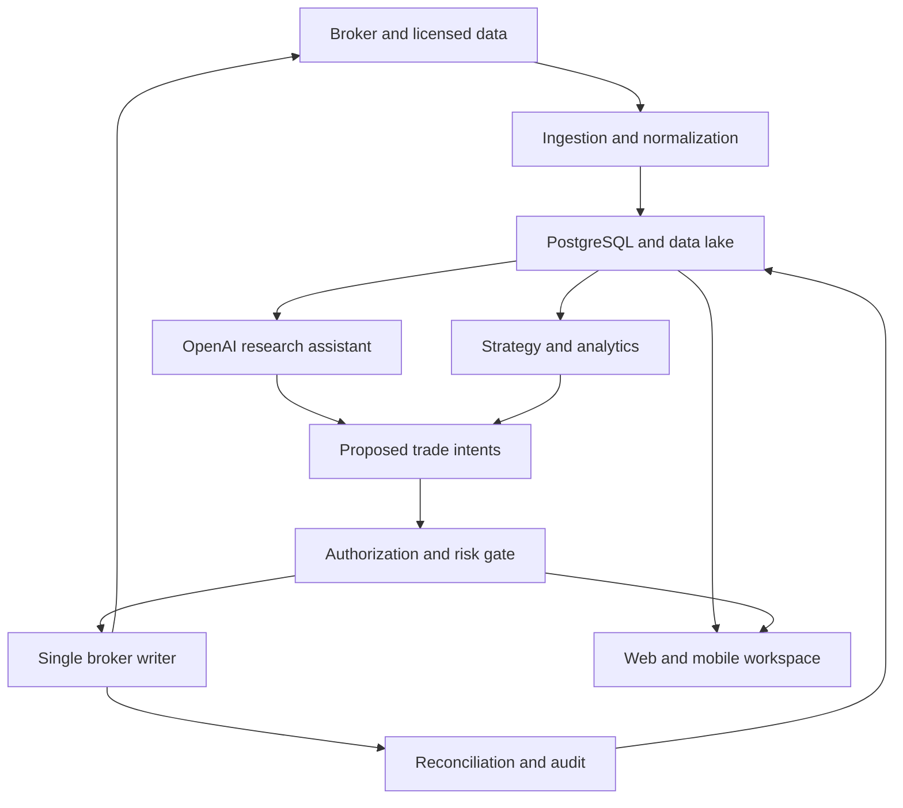
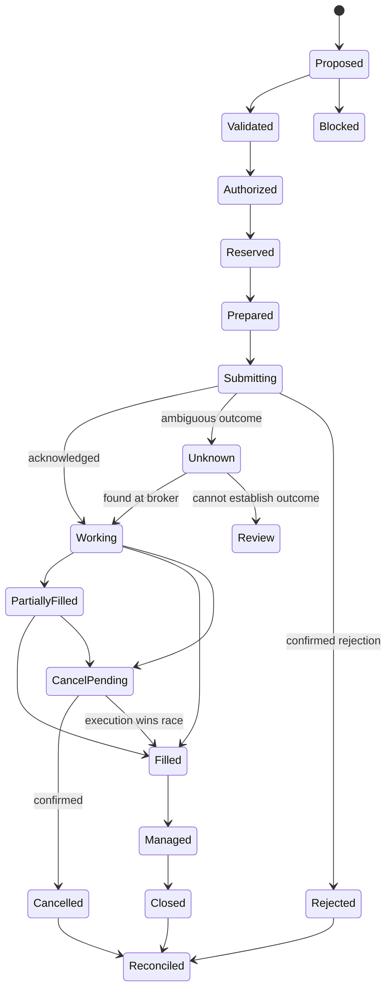

# Automated Stock and Options Trading Workbench

Implementation blueprint, revision 1 — researched October 6, 2026

Working product name: Trade Workbench.

This is a system design and implementation specification. No brokerage account has been connected, no market subscription purchased, and no orders submitted. All prototype balances, quotes, positions, dates, returns, and event names are illustrative. Proposed policies are engineering starting points that need account-specific calibration; they do not establish a profitable strategy.

## 1. Product goal and starting assumptions

Build a personal trading operating system that combines a trustworthy view of the brokerage account, market research, stock and options analytics, systematic strategies, bounded automation, and an OpenAI assistant. Its central output is a traceable decision: what the system observed, what it proposed, which rules passed or failed, what was submitted, what actually filled, and what changed in the account.

Initial scope: one U.S. individual trading their own tastytrade accounts, U.S. stocks and ETFs, equity and supported index options, USD reporting, swing trading and selected intraday strategies. Support cash and margin accounts through explicit account capabilities. A multi-user product, futures, futures options, crypto, international tax reporting, and institutional routing are expansion paths. Retail broker connectivity and model latency make this unsuitable as a high-frequency trading engine.

Use $10,000 only in worked examples. Do not infer a funded balance, options approval, desired leverage, or authorized live budget from previous conversations. Discover all of those from the account and the user's eventual configuration.

The best system is not the one that trades most often. Optimize reliability, research integrity, net performance after costs, usable decisions, and bounded operational failure. Allow the strategy to choose no trade. An idle strategy can be working correctly.

### 1.1 Non-negotiable engineering properties

1. Brokerage credentials stay in a server-side vault. The browser, model prompts, research notebooks, logs, and third-party notification payloads never receive them.
2. All account-changing commands pass through one controlled broker adapter. Manual UI orders and automated orders use the same validation path.
3. The AI may propose and explain. Deterministic services compute quantities, valuation, margin effects, risk decisions, authorization, and submission.
4. Read-only, broker sandbox, realistic paper, shadow, supervised live, and bounded live are visibly different environments. A portfolio has an environment identity, not just a colored label.
5. An ambiguous order submission becomes an unresolved incident. No automatic blind retry of a money-moving request.
6. Unknown data remains unknown. Missing earnings, invalid Greeks, stale quotes, and incomplete contract metadata cannot be silently converted into safe values.
7. Approved automation is bound to an immutable strategy version, an account, risk policy, product universe, capital limit, and validity period.
8. Stops and loss limits are operating controls, not a guarantee of a maximum realized loss. Gaps, assignment, outages, liquidity, and fees can exceed intended limits.
9. Every trade has a provenance chain and a management plan. External/manual positions remain visible even if the system did not create them.
10. Existing positions keep appropriate deterministic monitoring when the AI provider is unavailable. New AI-dependent entries can be suspended independently.

### 1.2 Measurable success

Measure order uncertainty, account reconciliation mismatches, duplicated executions, data age at decision, rejected submissions, slippage versus arrival price, fees, buying-power headroom, scenario losses, strategy drift, and alert acknowledgment. Measure user workflow completion: inspect a position, explain a trade, preview a portfolio change, pause a strategy, and recover after a disconnect. Trading performance is assessed separately with out-of-sample evidence and uncertainty intervals.

## 2. Existing products to study and what to adopt

These are researched design patterns, not copied proprietary UI or source code. Sources are listed in `10_Source_Register.md`.

| Product | Useful pattern | Our implementation decision |
|---|---|---|
| TradingView | Synchronized charts, watchlists, screeners, alerts, command search, replay | One research workspace with linked symbol selection; chart data comes from licensed feeds; reuse a chart library only under its license |
| OptionStrat | Multi-leg strategy construction, payoff exploration, candidate optimization | Build a visual trade composer with synchronized legs, expiry payoff, before-expiry repricing, and portfolio impact; label all model assumptions |
| Option Alpha | Scanner/monitor workflows, reusable automation, logs, backtest-to-bot continuity | Visual rule editor compiles to one versioned strategy definition; the same decision code runs in replay, paper, shadow, and live |
| Interactive Brokers Risk Navigator | Portfolio drill-down and hypothetical changes in price, time, volatility | Dedicated Risk Lab with before/after portfolio comparison and inspectable assumptions |
| QuantConnect / LEAN | Event-driven research and live brokerage integration | Evaluate LEAN against our required complex-order and risk workflows before choosing the research engine; do not reinvent a general backtester without a documented gap |
| TradeZella | Journaling, setup analysis, replay, performance breakdowns | Generate a journal from decisions and executions automatically; add notes without altering the original evidence |
| tastytrade | Options-centric account, chain, trade, and buying-power workflows | Keep broker-native concepts recognizable and provide a clear handoff to its application for unsupported actions |

The integration opportunity is substantial: QuantConnect documents tastytrade live support, and tastytrade now documents an options backtesting service plus a self-hosted MCP server. Evaluate all three. Use the MCP server as an optional read-only assistant integration initially; our production execution authority still lives in our application. Verify feature parity, permissions, environments, licensing, and supported order types with contract tests. [S01–S14]

## 3. Verified broker capabilities and engineering consequences

### 3.1 Authentication and account access

Current tastytrade documentation requires OAuth, with 15-minute access tokens and required `User-Agent` headers. Production and certification environments use separate credentials. A personal OAuth application is restricted to its owner's account; a product accepting other users needs tastytrade's third-party verification. [S01]

Implement a TokenManager with encrypted refresh-token/client-secret storage, expiry tracking, one refresh in flight per credential set, redacted logging, and an environment-bound client. Refresh using returned expiry metadata with a configurable safety margin. Do not hard-code a promise that refresh grants never change behavior; validate the current token response contract. Never log JWTs. If authorization is revoked, mark the connection unhealthy, suspend new entries, and alert the user with a broker-app fallback.

For personal setup, guide the user to create an OAuth application and personal grant, then enter secrets into the protected configuration flow. For eventual multi-user onboarding, use the verified authorization-code flow with state validation, exact redirect allowlisting, secure server-side exchange, and account discovery. Do not collect the brokerage password in our UI. Request read permission for monitoring; trade permission is enabled only for execution workers selected by the user.

### 3.2 Integration contract inventory

All paths below are broker paths, not the application's proposed API. Fetch the current OpenAPI schemas and exercise a certification contract test before implementing any mutation. Some indexed reference pages and explanatory guides disagree; the contract gate in section 3.5 exists to resolve this.

| Purpose | Broker operation | Adapter behavior |
|---|---|---|
| Access token | `POST /oauth/token` | Token refresh belongs to TokenManager |
| Accounts | `GET /customers/{customer_id}/accounts` | Resolve supported current-user alias/identity in discovery |
| Balances | `GET /accounts/{account_number}/balances` | Keep currencies, effect fields, broker timestamp |
| Positions | `GET /accounts/{account_number}/positions` | Normalize quantities and directions without losing raw payload |
| Restrictions | `GET /accounts/{account_number}/trading-status` | Account capability gate and rule-regime evidence |
| Quote stream token | `GET /api-quote-tokens` | Use returned stream URL and token expiry |
| Quote snapshot | `GET /market-data/by-type` | Batch instruments, record age and source |
| Option chain | `GET /option-chains/{symbol}/nested` | Instruments and streamer identifiers from broker metadata |
| Market sessions | `GET /market-time/equities/sessions/current` and session/holiday reference | Early closes and closures affect schedules |
| Entry preflight | `POST /accounts/{account_number}/orders/dry-run` | Persist costs, buying-power impact, warnings and schema version |
| Submit | `POST /accounts/{account_number}/orders` | Single writer, immutable payload, correlation identifier |
| Inspect | `GET /accounts/{account_number}/orders/{id}` | Order state and fill recovery |
| Reconcile orders | `GET /accounts/{account_number}/orders` and `/orders/live` | Read both recent history and active state with pagination |
| Cancel | `DELETE /accounts/{account_number}/orders/{id}` | Cancel requested is distinct from cancellation confirmed |
| Replace | `PUT /accounts/{account_number}/orders/{id}` | Preserve original leg semantics; confirm current edit restrictions |
| Edit preflight | `POST /accounts/{account_number}/orders/{id}/dry-run` | Validate allowed edits against the current contract |
| Brackets/related orders | `/accounts/{account_number}/complex-orders` and corresponding dry-run | Separate capability for OTO/OCO/OTOCO/PAIRS; instrument-specific tests |
| Broker margin view | `GET /margin/accounts/{account_number}/requirements` | Buying power is not the same as economic loss |
| Hypothetical margin | `POST /margin/accounts/{account_number}/dry-run` | Compare broker margin effect with our scenarios |
| Ledger | `GET /accounts/{account_number}/transactions` | Fees, fills, cash movements, corporate actions and reconciliation |

Paths are grounded in the broker's guides and reference groups [S02–S09]. The table is an adapter inventory, not a claim that all capabilities are available to every account.

### 3.3 Streaming

Use two long-lived connections with independent health: DXLink for quotes/Greeks and the account streamer for order/account updates. A working quote stream does not prove the account stream is healthy. The market connection obtains its URL from the quote-token response and uses the documented handshake. Instrument definitions provide stream identifiers; do not construct them from display tickers. A single backend subscription manager fans data out to strategies and browser sessions. [S02, S03]

Current documentation publishes market-stream limits, while REST thresholds are not a reliable universal published per-endpoint quota. Keep provider limits in a versioned capability registry, cache slow data, batch subscriptions, and implement exponential backoff with jitter. Reserve capacity for open positions and execution candidates before research watchlists. Never open one broker stream per UI tab. [S04]

Subscription priorities: open positions and closing orders first; imminent entry candidates second; visible chain and selected chart third; active strategy universes fourth; idle watchlists last. Count subscriptions by event type, not just instruments. Deduplicate reference-counted subscriptions and apply a grace period before unsubscribe to prevent scrolling-induced churn.

### 3.4 Four different testing contexts

| Context | Purpose | What it proves | What it does not prove |
|---|---|---|---|
| Broker certification sandbox | Validate auth, request shapes, statuses, account synchronization | Adapter and lifecycle compatibility | Tradable prices, realistic fills, profitability |
| Historical backtest | Execute a frozen strategy on historical inputs | Historical behavior under declared assumptions | Future returns or model-free execution realism |
| Realistic paper trading | Run live signals with our simulated execution | Live timing, data validity, scheduling, probable costs | Actual queue position or exchange fills |
| Shadow trading | Generate intents alongside a real portfolio without routing | Portfolio-aware decisions and divergence | Execution performance without live fills |

tastytrade documents synthetic certification fills, unavailable sandbox market-data routes, and daily state resets. Use separate production read-only data credentials when required for realistic simulations. Sandbox fill rules belong only to sandbox fixture tests; never inject them into performance research. [S05]

The documented tastytrade backtester runs at `https://backtester.vast.tastyworks.com`, with available-date discovery and backtest, log, and single-trade simulation operations. Test coverage, strategy expressions, cost assumptions, corporate-action handling and live parity before adopting it. Archive its original outputs alongside our normalized results. Our own quote-based replay remains necessary for unsupported strategy logic and independent validation. [S06]

### 3.5 Capability discovery and unresolved contracts

Create `broker_capabilities` records with account, environment, capability, schema hash, evidence, verification date, status, and expiry. Enabled status requires a successful test, not a documentation link alone.

Resolve at implementation kickoff: current-user identity/account alias; option exercise and do-not-exercise support; short stock availability; fractional equity eligibility; complex brackets for each instrument class; option contract units and rounding; streamer ordering/replay guarantees; margin evaluation latency; order search completeness; third-party scope approval; options backtester coverage/entitlement; historical quote retention; and exact cancel/replace behavior.

There is a concrete documentation conflict: some reference banners tell clients to send `ext-client-order-id`, while the idempotency guide says that field is system-populated and identifies `external-identifier` as the request correlation field. Use the current request schema and sandbox tests to settle it. Disable live capability if unresolved. Neither field should be assumed to provide broker-side deduplication. [S07, S08]

Day-trading rules also need a live configuration source. FINRA describes a transition from PDT rules to new intraday-margin requirements, with brokerage implementation varying during the transition period. Do not hard-code a universal $25,000 gate or assume it has disappeared for this specific account. Store the broker-confirmed regime and query trading status. [S24]

## 4. Product map and completeness boundaries

Organize the application around decisions and work, with optional advanced tools revealed inside each area.

| Area | Baseline capabilities | Advanced capabilities |
|---|---|---|
| Overview | Account value, deployed risk, pending actions, active strategies, system state | Custom workspace layouts, household aggregation |
| Markets | Watchlists, charts, basic scan filters, catalysts | Linked charts, relative strength, breadth, factor analysis, custom indicators |
| Research | Filings, licensed news, evidence-based briefs, scenarios | Thesis tracking, research experiments, alternative datasets |
| Options | Chain, contract metadata, Greeks, IV and liquidity views | Skew/term structure, vol surface diagnostics, flow with limitations |
| Trade builder | Stock and option tickets, payoff, preflight, exit plan | Strategy optimizer, roll comparisons, custom scenario distributions |
| Portfolio | Positions, strategy groups, lots, orders, cash and P/L | Exposure trees, hedge comparison, return attribution |
| Risk Lab | Limits, concentration, stress scenarios, buying power | Historical scenarios, CVaR, covariance ensembles, sensitivity surfaces |
| Automation | Strategy definitions, scanner/monitor rules, budgets, mode controls | Visual recipes, parameter sweeps, regime switching, portfolio allocation |
| Research Lab | Backtests, replay, paper/live comparison, experiment registry | Walk-forward studies, robustness maps, experiment screening |
| Orders | Blotter, reconciliation, bounded repricing, execution evidence | Transaction-cost analysis and execution-policy optimization |
| Journal | Auto-generated trade record, notes, fees, setup attribution | MAE/MFE, behavior analysis, decision-quality reviews |
| Alerts | Action inbox, severity, acknowledgment and channel settings | Escalation policies, webhook integration, event correlation |
| Operations | Connectivity, data freshness, restart state, kill controls | Incident replay, drift reports, disaster recovery |
| Settings | Secrets, account capabilities, risk policies, model budgets | RBAC, tenant isolation, audit retention and licensing |

An initial release must be excellent at its supported instruments. It should clearly identify unsupported adjusted contracts, actions and feeds. A visible unavailable feature with a specific reason is better than silently producing an inaccurate estimate.

## 5. Modes, permissions, and durable authorization

### 5.1 Modes

- **Read-only:** real account observation; no write credential accessible to the application role.
- **Sandbox:** broker certification orders; isolated state and credentials; no performance claims.
- **Paper:** real or replayed licensed market data, internal simulated orders, isolated paper ledger.
- **Shadow:** real account state and real timing, intent generation only, no broker routing.
- **Supervised live:** user approves a specific reviewed intent; authorization expires when payload, risk, account, or freshness changes.
- **Bounded live:** a user-approved strategy version can act within its policy and capital limits. No per-trade prompt is needed inside the approved envelope.
- **Manage existing only:** opening exposure is blocked; permitted exits/hedges follow a declared management policy.

Changing a mode is a command with a resulting state and audit event. An UI label change alone cannot alter backend permissions. Enabling live trading requires a configured account, matching verified capability, deployed risk policy, tested management path, and an explicit activation command. This blueprint authorizes planning only; no live setup is performed now.

### 5.2 Authorization object

Store authorization ID, user, account, environment, strategy artifact hash, risk policy hash, approved instruments/products, maximum aggregate budget, maximum per-trade size, schedule, expiry, manager version, exit permissions, and revocation state. Bind the proposal payload and execution policy hash to single-trade approvals. A changed limit price beyond the reviewed range requires a new intent or prior authorized price corridor.

Capability levels: view account, edit drafts, run simulations, approve intent, activate strategy, pause entries, cancel entry orders, manage positions, export records, manage secrets, change global risk limits. In personal mode the same user can hold every capability, but application worker identities cannot.

### 5.3 Emergency controls

Provide separate actions: pause new entries; cancel working entry orders; cancel selected/all eligible orders; manage existing only; prepare a flatten plan; execute an approved flatten plan. Do not label all five with an ambiguous kill button. A pause should not cancel protective exits. Flattening options requires a fresh portfolio snapshot and ordered plan because removing protection can raise risk or buying-power requirements. Surface positions that cannot be closed and keep the incident open. A broker application remains the independent control path.

## 6. Recommended architecture

Start with a modular backend and a few isolated worker roles, not a fleet of microservices. Shared domain contracts and tests are more valuable than premature distribution.

### 6.1 Technology choices

| Layer | Proposed choice | Reason and boundary |
|---|---|---|
| Frontend | React, TypeScript, accessible component primitives, client query/cache layer | Rich tables, chart coordination, typed API contracts |
| API | Python with FastAPI/Pydantic-style typed validation | Async feeds and a strong quantitative ecosystem |
| Authoritative state | PostgreSQL with migrations | Transactions, unique constraints, durable outbox and audit |
| Hot cache | Redis only when needed | Quote fan-out and ephemeral cache; never sole order truth |
| Research storage | Parquet object store and DuckDB | Reproducible, subset-oriented historical analysis |
| Quant layer | NumPy/Pandas or Polars, vetted option-pricing implementation | Validated numeric routines; no LLM arithmetic authority |
| Research engine | LEAN proof of concept, native tasty backtester adapter, custom narrow replay as required | Pick after parity tests; adapters preserve result provenance |
| Model interface | OpenAI Responses API with typed functions and structured output | Controlled retrieval, proposals and explainable summaries |
| Background work | Durable DB-backed job queue initially; managed workflow engine only if complexity warrants | Schedules, retries, recovery and idempotent read tasks |
| Deployment | Containers on a managed VM/service with PostgreSQL, secrets manager, object storage | Small operational footprint with clear isolation |
| Observability | Structured logs, distributed trace IDs, metrics and external heartbeat | Detect missing workers even if the app fails |

Use current supported versions when implementing, pin dependency lockfiles, and validate official documentation at that time. Do not decide a model by an unverified marketing name; use a model registry and compare task-specific quality, latency, structured-output adherence, and costs.

### 6.2 Module boundaries

**Identity and policy:** users, sessions, capabilities, account access, approvals, strategy activation. **Broker adapter:** token management, reads, submissions, cancels, replacements, account stream. **Market data:** instruments, streams, snapshots, licensed history, calendars. **Quant:** Greeks, payoff, scenario repricing, indicators, exposure and costs. **Strategy:** versioned definitions, features, signal evaluation, opportunity ranking. **Risk:** policy checks, reservations, portfolio aggregation, stress and incident state. **Execution:** immutable intent preparation, lifecycle, controlled writer, fill assembly. **Portfolio:** ledger, lots, reconciled snapshots, strategy attribution. **AI:** bounded tools, evidence packs, schemas, evaluation and cost budgets. **Research:** experiments, datasets, simulations, replay and promotion gates. **Communication:** alert state, channels, summaries and acknowledgment. **Operations:** health, recovery, backup and drift.

### 6.3 Processes and ownership

API/UI worker serves reads and commands. Ingestion worker owns feed connections and durable raw append. Strategy workers read normalized state and create intents. A single execution worker for an account owns brokerage mutations. AI workers run outside the order-critical path. Research workers are resource-limited and cannot access live write credentials. Notification workers consume durable outbox events.

One database can initially serve all modules, with separately scoped roles. Every worker command includes account/environment. Replace hard-coded cross-module calls with interfaces only where necessary. Keep a transactional core; introduce a broker/event bus later only if measured scale or isolation needs justify it.

### 6.4 Event reliability

Use an append-only event envelope with event ID, schema version, type, aggregate ID, aggregate revision, account/environment, occurred time, received time, correlation ID, causation ID, source, and payload. Financial commands/events live in PostgreSQL; high-volume raw market observations live in partitioned files with indexed decision snapshots. Write state changes and outbox messages in the same transaction.

Consumers process at least once and deduplicate by event ID. Ordering is guaranteed only within our recorded aggregate sequence, not across every external feed. Timestamps alone are not a total order. Do not claim end-to-end exactly-once brokerage effects: the external broker does not enforce our local uniqueness constraints.

## 7. Data acquisition and quality system

### 7.1 Source plan

| Data | Primary route | Complement/fallback | Storage/use |
|---|---|---|---|
| Accounts, orders, positions, buying power | tastytrade REST and account stream | REST reconciliation and broker UI | Authoritative broker snapshots and normalized ledger |
| Live equities/options quotes and Greeks | Entitled tastytrade DXLink stream | Licensed independent feed if operationally justified | Latest validated quote cache plus decision evidence |
| Historical equities | Selected licensed vendor dataset | Broker candles for supported exploratory tasks | Raw and adjusted bars with corporate-action versions |
| Historical option quotes | Evaluate Massive versus Databento on the target universe | Supported broker backtester as a comparison engine | Contract definitions, quotes, costs and data manifest |
| Option contract definitions | Broker instrument/chain endpoints | OCC adjustment evidence/vendor metadata | Effective-dated instrument master |
| Earnings and dividends | Broker metrics plus licensed event calendar | Issuer releases/filings for confirmation | Timestamped event records, confidence and revisions |
| Company fundamentals | SEC submissions and XBRL APIs | Licensed normalized fundamentals | Filing accession, publication timestamp and units |
| Macro and rates | FRED/ALFRED and appropriate market feeds | Official calendars for releases | Observation vintage, publication and availability times |
| News and transcripts | Licensed provider selected during discovery | Company investor relations and SEC filings | Permitted content, IDs, timestamps, source links |
| Halts/sessions/corporate actions | Broker status/calendar and licensed feed | Exchange/OCC verification where required | Risk gate metadata and replay events |

Massive documents historical option quotes; Databento documents OPRA live/historical data and NBBO reconstruction. Evaluate their actual entitlement, adjusted-contract coverage, historical depth and price on a small representative sample. Do not scrape consumer platforms or treat a free/delayed quote as executable. [S15, S16]

SEC supplies unauthenticated submissions/XBRL data, and FRED exposes economic series and vintage-related APIs. Run ingestion on the backend, with service-appropriate identification, cache, throttling, and use rights. [S17, S18]

### 7.2 Minimum data needed before a first strategy

Get instrument metadata, live bid/ask and size, chain definitions, effective multiplier/deliverables, account restrictions, buying-power data, holiday/session calendar, and event dates. Add quote history before claiming an options strategy has been backtested credibly. For a stock-only baseline, adjusted bar history and realistic execution assumptions can support the first experiment.

Start with a focused liquid universe. Broader market scanning can use inexpensive bar snapshots to identify candidates, followed by quote and option subscriptions only for survivors. Do not subscribe to every strike of every equity continuously by default.

### 7.3 Canonical timestamps and provenance

Represent event time, source publication time, provider time, our ingestion time, and feature availability time separately. Store UTC; display exchange time and user-local time with clear labels. Instrument sessions use their exchange calendar. Market timestamps need high resolution; database timestamptz alone is not enough if the vendor exposes nanoseconds, so retain original integer timestamps.

Decision inputs are immutable snapshots referenced by hash. Each snapshot contains instrument definition revision, latest eligible quotes per leg, underlying price, event/calendar version, rates/dividends assumptions, computed features, account snapshot revision, and data-quality results. Every feature has a calculation version and maximum permissible age.

### 7.4 Quote validation

Check numeric validity, bid/ask non-negativity, bid <= ask where the feed semantics require it, size validity and units, instrument match, source latency, exchange session, halt state, and timestamp plausibility. Locked/crossed markets are a flagged condition; define which orders may proceed, if any. A quiet option may legitimately have no recent event, so distinguish last-event age from transport health and verified snapshot freshness. Missing bid does not mean an option can be sold at its last trade price.

Classify data: valid, valid-but-illiquid, stale, incomplete, suspect, unavailable. A fallback price is labeled with source and confidence; it must not automatically qualify for routing. Price differences across providers may reflect timestamps/venue coverage. Align time before declaring a discrepancy.

### 7.5 Refresh policy examples

Use push updates for prices and accounts. Recompute small position exposures on relevant data events with short debounce; batch portfolio scenarios to a slower cadence. Reconcile active account state every configurable 30–60 seconds initially, on stream reconnect, around order anomalies, and before material commands; tune based on API limits and measured load. Chain definitions can be cached intraday with explicit refresh triggers for expiry/listings. Fundamentals and calendars update on source events/daily jobs. These cadences are design defaults, not broker service guarantees.

### 7.6 Storage and licensing

Retain permitted raw data with provider, dataset, schema and entitlement version. Partition historical objects by dataset/date/underlying or an appropriate cardinality-controlled key; do not create tiny files per event. Compact batches, checksum them, and store a reproducible manifest. Keep only quote slices needed for the universe and research horizon unless a broader license and budget justify full-feed capture. Options data volumes can overwhelm a retail project.

Persist decision evidence under the vendor's storage and derived-data rights. Some licenses distinguish display, non-display, redistribution, and AI use. Record each dataset's allowed consumers, retention, user class and commercial restrictions. Broker availability is not automatically permission to redistribute or upload all raw data to a model provider.

### 7.7 Point-in-time correctness

Research must use the instrument universe, delisted securities, corporate actions, financial statements, event schedules, and macro vintages available at each historical decision time. Today's chain cannot be retroactively reused as yesterday's universe. Open interest may be reported on a delayed schedule; make its availability explicit. Prevent using a complete day's high/low or final candle before it closes. Keep revisions rather than overwriting their original timestamps.

Historical LLM tests have an additional leakage problem: a modern model may already know later outcomes. Data timestamp controls alone do not remove training-set knowledge. Limit historical AI extraction to grounded facts, isolate evaluation datasets, and rely heavily on prospective paper/shadow evaluation for AI-dependent selection.

## 8. Instrument and numerical model

### 8.1 Instrument master

Store stable internal instrument ID, type, display symbol, broker symbol, vendor symbols, streamer symbol, underlying ID, currency, exchange/calendar, tick rules, quantity steps, option right/strike, expiration date/time, last trading time, exercise style, settlement style, multiplier, deliverables, adjusted flag, contract revision and effective interval. An option's expiration date alone does not determine last trading time or settlement mechanics.

Ordinary U.S. equity option examples often use 100 shares per contract, but adjusted contracts require exact metadata. Model share/cash/other deliverable baskets separately from a numerical premium multiplier. Unsupported baskets are blocked from automated trading. Index cash settlement is different from stock delivery; do not apply equity assignment logic to every option. [S19]

### 8.2 Numerical conventions

Use Decimal or fixed-point for money, prices, strikes, quantities and broker payloads; floating point is acceptable in validated analytics with explicit tolerances. Do not use binary floating point to decide compliance with a price tick. Serialize broker prices according to the schema. Currency sign, position direction and premium debit/credit are separate concepts.

Normalize Greek units before aggregation: option delta per underlying price unit; gamma per underlying price unit squared; theta per day; vega per one volatility percentage point or explicitly converted unit. Vendor unit definitions require contract tests. Keep the raw units and normalized units both. Greeks can be missing or unstable, especially near expiry and for illiquid strikes.

### 8.3 Required calculations

- Position market value and hypothetical liquidation value with explicit bid/ask assumptions.
- Realized/unrealized P/L including commissions and accrued financing; separate broker values from internally computed estimates.
- Stock/option expiry payoff with fees and exact contract terms.
- Before-expiry scenario valuation using a declared pricing model, rate curve, dividend assumptions and volatility surface.
- Cash flows, cost basis, break-even points and extrema for supported strategies.
- Delta-equivalent shares, dollar delta, normalized SPY-equivalent beta exposure, gamma, theta and vega.
- IV rank and percentile with stated lookback, IV definition, missing-data policy and annualization convention.
- Historical/realized volatility, ATR, moving averages, momentum, relative strength, volume and liquidity measures.
- Expected move as a model-derived estimate, not a statistical guarantee; disclose whether using ATM straddle or volatility formula.
- Scenario loss, liquidity-adjusted liquidation cost, margin headroom and capital tied up under assignment.

For ordinary unadjusted shares/options, signed dollar delta is approximately `quantity × multiplier × delta × underlying_price`; for stock, multiplier and delta are 1. Raw share deltas across unrelated tickers are not directly comparable. Convert portfolio beta exposure using a benchmark and a documented estimation window. Do not sum dollar gamma or vega until units and shocks are consistent.

### 8.4 Worked sizing example

For a standard $5-wide credit vertical collecting $1.20 with a 100 premium multiplier, terminal economic loss before costs is `(5.00 - 1.20) × 100 = $380` per spread. A $100 per-trade limit allows zero spreads, even if the trade feels conservative or has a high model probability of profit. Include anticipated fees and closing cost before sizing.

For a standard debit spread paid $0.80, terminal loss before costs is $80. With a $100 budget it might allow one, subject to liquidity, costs, assignment, portfolio exposure and account constraints. Mathematical expiry loss is conditional on intended legs remaining intact and correct settlement; it is not a hard upper bound on every operational outcome.

Formula: `allowed_qty = floor(min(trade_budget / conservative_unit_risk, sleeve_remaining / unit_risk, global_remaining / unit_risk, broker_capacity / unit_bp, liquidity_capacity))`, with instrument quantity steps and conservative cost buffers. For stocks, distinguish stop-distance planned risk from a separate gap/stress risk; price gaps can exceed the stop budget.

## 9. OpenAI integration

### 9.1 Role of the assistant

The assistant should explain the portfolio, summarize licensed/primary research, maintain a thesis, compare approved structures, build draft strategy definitions, identify inconsistent plans, describe alerts, and answer questions using our own trusted tools. It may produce structured trade proposals and ranked candidate explanations. It cannot bypass authorization, change risk policy, fabricate prices, or gain write credentials.

Use OpenAI function calling for controlled application tools and structured output for schema-constrained proposals. Schema adherence does not prove factual truth, price accuracy, mathematical correctness, or trading edge. Validate all outputs server-side. [S20, S21]

### 9.2 Tool catalog

Read tools: `get_account_snapshot`, `get_portfolio_exposure`, `get_position_detail`, `get_market_snapshot`, `get_options_chain_slice`, `get_contract_metadata`, `get_event_calendar`, `search_research_evidence`, `get_strategy_version`, `get_backtest_summary`, `get_execution_timeline`, `compare_hypothetical_portfolios`.

Draft tools: `create_trade_proposal`, `create_strategy_draft`, `request_backtest`, `create_alert_draft`, `append_journal_note`. These create reviewable application objects, not broker orders. Tools require account/environment and server-resolved IDs; the model cannot substitute arbitrary account numbers or URLs.

No general-purpose `place_order` tool in the conversational assistant. In bounded automation, a trusted strategy runner can consume a validated AI proposal under a preapproved policy. The authorization/risk engine and controlled writer still decide whether it becomes an executable intent. The optional broker MCP server is configured read-only and explicit environment initially. [S10]

### 9.3 Context pack

Construct a small task-specific pack: question, user goals/policy, account snapshot revision, relevant position/underlying slice, recent data timestamps, contract metadata, specific source excerpts with evidence IDs, known missing data, allowed strategy universe, supported tools and budget. Never transmit a full account identifier, credentials, unnecessary personally identifying information, or an entire option chain when a slice suffices.

Every factual claim from the assistant carries an evidence ID or is explicitly a hypothesis. Numeric prices and risks in the final response come from tool outputs, not model recall. The assistant must say when evidence is unavailable and allow abstention. Its self-reported confidence is not a calibrated probability of profit.

### 9.4 Proposal contract

A proposal contains ID, creation/expiry time, account/environment, strategy version reference, instrument IDs, intent type, thesis, evidence IDs, invalidation condition, candidate leg ratios, desired price corridor, intended holding window, event exclusions, management-policy reference, and missing-data flags. The quant/risk layer enriches it with verified symbols, executable quantity, cost estimate, scenario results and policy decision. The model cannot set the final account risk authority.

Require strict JSON schemas with all object properties declared, required fields, and `additionalProperties: false`; represent genuinely optional values with null where required by the API's schema subset. Pin schema/prompt versions and reject unsupported fields. Process refusal, incomplete output, timeout, malformed evidence IDs, and tool errors as explicit results. [S20]

### 9.5 Model routing and budgets

Small validated model/task path for source classification and simple extraction; higher-quality reasoning path for a portfolio explanation or strategy draft; separate embedding/search path if justified. All model choices are configuration, evaluated on our cases, and pinned per strategy/evaluation version. Shadow a new model before enabling it in an AI-dependent live strategy.

Do not call the model on every quote. Trigger on selected events, scheduled research, user queries, and a meaningful change in context. Cache analyses by evidence/input hash. Batch offline labeling where supported. Track tokens, latency, tool calls, failure, cost and quality by workflow. Set monthly/day budgets and per-workflow call caps; exhausting the model budget pauses AI-dependent new work while deterministic monitoring continues.

### 9.6 Data security and prompt injection

Treat news, filings, web pages and user uploads as untrusted evidence, never instructions. Keep system policy and capabilities outside retrieved text. Escape content in the UI and prohibit arbitrary network/shell operations in model tools. Restrict query scope to the user's authorized account. Use retention-minimizing API configuration where appropriate, while acknowledging that `store: false` alone is not a universal zero-retention guarantee across API features and processing. [S22]

### 9.7 Evaluation set

Include grounded versus fabricated catalysts, stale quote refusal, unsupported contract refusal, spread-direction correction, wrong account attempts, prompt injection in an earnings release, missing-data abstention, conflicting research, math pulled from quant tools, impossible payoff claims, and safe behavior during tool outage. Evaluate factual support, correct tool selection, schema conformance, abstention, unauthorized action rate, latency and cost. Target zero unauthorized mutations in the adversarial suite.

## 10. Strategy system

### 10.1 Strategy taxonomy

Support templates for long equity/ETF allocation, momentum/relative strength, trend pullback, bounded mean reversion, pairs/factor-neutral ideas, covered calls, cash-secured puts/wheel, debit verticals, credit verticals, iron condors, butterflies, calendars/diagonals, collars/protective puts, long-volatility straddles/strangles, and hedge overlays. Templates are starting definitions, not endorsements or evidence of an edge.

Treat leveraged ETFs, 0DTE, earnings events, short stock and uncovered options as separate capabilities with stronger data/management/research gates. A covered call still has stock downside. A cash-secured put still has equity-like downside. Calendars and diagonals have expiry/assignment complexity. Short premium has tail and volatility risk even with a high win rate. Long options may lose their entire premium. Risk labels describe actual exposures and scenarios, not just structure names.

### 10.2 Immutable strategy definition

Fields: strategy ID and version, owner, instrument universe, selection schedule, warm-up requirements, feature definitions/versions, entry rule AST, contract selection, position sizing, portfolio conflict policy, execution policy, exit rule AST, assignment/expiry policy, event exclusions, maximum hold duration, allowed modes, risk policy, capital sleeve, and dataset requirements.

Use a typed rule AST such as `all`, `any`, `not`, numeric comparisons, crossovers, schedule windows, state predicates, and portfolio predicates. Resolve every feature name in a registry with data dependencies and unit types. No arbitrary Python expression string in a production visual strategy. Research code extensions run in restricted processes and are versioned artifacts.

### 10.3 Rule evaluation

The evaluator returns PASS, FAIL, or UNKNOWN plus input/evidence details. UNKNOWN blocks entry by default. Exit policies specify whether a degraded-data exception is allowed and what bounded action it permits. Each evaluation creates a compact decision record even when no trade is selected. Explain the first decisive failure and allow drill-down to all predicates.

Signals are candidates, not orders. Rank them using a documented score including expected cost, liquidity, forecast uncertainty, portfolio risk contribution, event exposure and capacity. Calibrate statistical probabilities against realized outcomes; separate model-derived risk-neutral probabilities from subjective return forecasts. A 0.30 option delta is not an assured 30% probability of loss.

### 10.4 Lifecycle and promotion

Draft → static validation → historical research → locked candidate → live paper → shadow → supervised small live → bounded live → paused/manage-only → retired. Versions do not mutate after promotion. New parameters create a new version with a comparative research run. Exit management can continue under the prior version for existing positions while entries use a new approved one; record that split explicitly.

Every promotion has a reproducibility manifest and operational evidence. Do not promote based solely on a high Sharpe ratio, profit factor or recent P/L. A strategy can pass engineering gates while failing research gates. Retirement preserves history and stops new entries; it does not abandon open trades.

### 10.5 Different risk sleeves

Allow sleeves for Core, Systematic, Opportunistic, and Experimental, with user-defined dollar caps and permitted structures. Use virtual allocation accounting within the broker account; sleeves are not truly isolated brokerage accounts. Global concentration, cash and margin rules always override individual budgets.

For a $10,000 illustrative configuration, one could leave $3,000 cash reserve, cap Core at $4,000, Systematic at $2,000, and Experimental at $1,000. That is a budgeting example, not an allocation recommendation. Do not fund every sleeve by default. Mark-to-market losses lower available budgets; winning streaks do not automatically raise authorization caps.

### 10.6 Strategy conflict management

Define underlying-level ownership and conflict policies: exclusive, share direction, allow hedging, or manual review. Two bots may otherwise create opposing positions or each consume the same buying power. Evaluate portfolio state plus pending reservations atomically. Net broker positions can merge quantities from multiple virtual strategies; attribution must track virtual lots without claiming separately closeable broker inventory.

Any external order/position from the broker UI enters an Unassigned bucket. Portfolio risk includes it immediately. Importing it into a strategy requires a reviewed management policy. Never have a bot close a manual holding merely because its symbol matches a signal.

## 11. Execution engine and order lifecycle

### 11.1 Trade pipeline

1. Receive an immutable candidate with account/environment and a strategy artifact reference.
2. Deduplicate the intended decision by strategy version, signal key and decision window.
3. Resolve exact instruments and quantities from current metadata; verify product/account support.
4. Assemble a market snapshot and account revision; validate data quality and calendar.
5. Quant engine computes costs, payoff, portfolio impact, margin request and sizing.
6. Authorization and global risk gate check the exact payload and execution policy.
7. Reserve risk/capital in a transaction across all running strategies.
8. Call broker dry-run; persist the raw response and warnings. A warning may require user review or a predefined policy; never silently suppress it.
9. Recheck quote/account/policy versions and available authorization. If meaningful inputs changed, regenerate/revalidate.
10. Persist the prepared payload, payload hash, unique correlation identifier, writer claim and durable audit event before making the network call.
11. Writer submits once and records the response or an UNKNOWN outcome.
12. Stream and REST reconciliation assemble fills, commissions and resulting positions.
13. Transition reservations into actual exposure, retaining unresolved residual reservations.
14. Activate the management policy for filled quantity; do not wait for a planned full order if a partial execution already created risk.
15. Emit notifications and a journal event with links to the evidence timeline.

### 11.2 Internal state machine

Maintain separate internal intent state, raw broker status, filled quantities by leg, management state and reconciliation state. Broker labels alone are not our lifecycle truth.

A broker may report a terminal filled state before all execution records are retrieved. Track expected versus observed fills and reconcile again; do not invent an execution. Partial fills are inferred from quantities even if the broker does not expose a separate partial-fill status. [S09]

### 11.3 Duplicate prevention and ambiguity

Persist our unique intent before submission, with unique local correlation and intent constraints. The broker correlation field is not a guaranteed idempotency mechanism. On timeout or unclear 5xx, keep risk reserved, inspect order history and live state with pagination, examine fills/transactions/positions, and reconcile for a bounded window. A single empty search is not proof that no order exists because visibility may lag. If ambiguity remains, block equivalent new orders and require explicit incident resolution. [S07]

Exactly-once is a goal for local command acceptance, not a promise about external exchange effects. A writer crash after submit and before recording the response is an expected case. Restart recovery always reconciles that intent before continuing.

### 11.4 Single account writer and failover

Use one account writer with lease identity and monotonically increasing fencing token stored in the database. Only the broker gateway holds write credentials. Validate the current lease/fence immediately before each network command. A local fence cannot revoke an already in-flight broker request; a leader handover therefore freezes new submissions until old requests are reconciled and the previous writer is stopped or isolated. Do not automatically create a second writer merely because a heartbeat expired. Prefer recoverable downtime to overlapping live order writers.

### 11.5 Multi-leg orders

For supported spreads, route one net-price combo order, not independent leg orders. Current guides describe up to four option legs; validate distinct symbols, ratios, quantities, net debit/credit, account approval and contract terms. Stock-plus-option and more complex structures may require staged execution or unsupported-state review. Do not claim atomic execution across separate broker orders. [S08]

Residual fills or legging create explicit exposure and a recovery plan. Preserve protective long legs while closing shorts where appropriate; compare account-level risk before and after any close. Rolling is a linked close-and-open economic decision, not merely postponing a loss. Show realized P/L of the old position and incremental risk/cost of the new one.

### 11.6 Price policy

Initial limit is chosen from a declared corridor using synchronized quotes. A midpoint is a reference, not an executable promise. For entry, favor bounded limit orders. Configure tick-correct increments, minimum time between replaces, maximum attempts, maximum elapsed time and an absolute worst price. Repricing cannot enlarge quantity or exceed approved debit/reduce credit beyond authority.

For risk exits, use a separately authorized urgency policy: patient limit, more aggressive marketable limit within a cap, then alert/escalation. Options market orders are disabled by default. A cap can leave an order unfilled; make that state visible. Stock market/stop orders may be available when supported and explicitly authorized, with gap/slippage limits understood.

Cancel/replace rereads status and remaining quantities, validates the edit, then follows the broker's supported operation. Never treat cancel-requested as cancelled. Never reserve the original and replacement as independent risk if the broker guarantees contingent replacement, but do not release the original until status/fill evidence supports it. Complex orders need their own tested behavior. [S08, S09]

### 11.7 Management engine

Every position has management owner, latest policy version, trigger basis, profit target, loss/invalidation trigger, hold limit, expiry handling, event policy, hedge permissions, and desired action state. Trigger basis can be option net liquidation estimate, underlying price, portfolio exposure, time, event or thesis invalidation. Price triggers require valid quotes and noise/debounce rules to prevent acting on one suspect mark.

Broker-resident stops/brackets survive our outage when supported, but their order semantics and partial-fill behavior must be tested. Software exits do not survive backend failure. Show that distinction on the trade review. Do not offer a protection label unless a corresponding order/policy is actually active and observable.

## 12. Risk policy engine

### 12.1 Hierarchy

Global user risk → broker account constraints → strategy/sleeve limits → underlying/factor/event concentration → individual trade limits → execution controls. A stricter rule wins. Manual trades cannot bypass global limits. User overrides are separate audited commands and cannot bypass broker restrictions or unresolved order state.

### 12.2 Checks required before opening exposure

Verify credentials/environment, account ownership and trading status, policy and strategy authorization, portfolio reconciliation, no overlapping UNKNOWN intent, valid quote/contract/calendar, instrument eligibility, position ownership conflicts, liquidity, spread cost, tick/quantity constraints, buying-power headroom, cash settlement, contract loss/stress loss, portfolio delta/vega/gamma, factor/sector concentration, earnings/macro windows, assignment funding, daily loss state, scheduled mode and total pending reservations.

Every check returns ID, severity, PASS/FAIL/UNKNOWN, measured value and unit, threshold, input provenance, policy version, explanation and allowed remedy. Avoid a single opaque risk score that conceals why a trade failed.

### 12.3 Illustrative initial policy

| Control | Example for an initial $10,000 test account | Meaning |
|---|---|---|
| Live automation | Off until activated | Planning does not arm an account |
| Per-trade modeled loss | $100 inclusive of expected costs | Reject an indivisible contract that exceeds it |
| Aggregate new automated risk | $500 | Include working-order reservations and existing bot exposures |
| Cash reserve | $3,000 | Broker buying power may permit more than we authorize |
| Daily loss circuit breaker | $200 relative to a cash-flow-adjusted opening reference | Pause entries and apply predefined management; not a guaranteed loss cap |
| Max active new bot positions | 5 | Still subject to global exposure limits |
| Expiry automation | No new 0DTE entries initially | More evidence/controls required before enabling |
| Uncovered options | Disabled | Permissions alone are insufficient authority |
| Earnings holds | Block new exposed entries when calendar is uncertain or inside a declared exclusion window | Long and short structures need separate policies |
| Leverage/short stock | Disabled initially | Enable as separate capabilities |
| Option entries | Net-price limit combos | No arbitrary legging by default |
| Stale/unknown state | Block new risk | Escalate existing risk under its management policy |

These are test defaults, not personalized investment advice or optimized thresholds. Configure stock stop risk and worst-case gap stress separately. Low/medium/high profiles are different policies, not a switch that skips risk analysis.

### 12.4 Continuous portfolio stress

Scenarios include benchmark ±1/3/5/10%, relevant single names ±10/20/40%, volatility ±5/10/20 percentage points, skew/term-structure changes, time roll to near/at expiration, event gaps, correlations increasing toward one, spread widening, delayed exits, and broker margin/financing shocks. Shock magnitudes are user-configurable research assumptions. Reprice nonlinearly for large changes; delta-gamma approximation is only a small-shock diagnostic.

Show current and proposed portfolio results side-by-side, worst scenario, major loss contributors, liquidation assumptions, confidence/coverage, and sensitivity to pricing method. Missing metadata blocks a reliable portfolio result; list unsupported positions rather than silently omit them.

### 12.5 Statistical risk

Add historical VaR/CVaR, scenario distributions, drawdown limits, loss streak monitoring and forecast calibration as advanced tools. Report observation window, horizon, confidence level, number of samples and nonstationarity limitations. Tail estimates with few events are unstable. Monte Carlo outputs must identify the process and dependence assumptions. A mathematically precise display is not proof the underlying model is true.

### 12.6 Expiry and assignment

Track cash/share delivery obligations, dividend timing, early assignment likelihood indicators, deep ITM shorts with little extrinsic value, borrowing costs, pin risk, AM/PM settlement, holidays, exercise/do-not-exercise deadlines, and broker liquidation policy. Generate an expiry action list ahead of internal cutoffs, not just at the final minute. Supported long/short legs can exercise or assign asymmetrically and leave stock exposure. High-level spread loss calculations do not remove that operational risk. [S19]

Until exercise/DNE capability is explicitly verified, the automated system's default is to close eligible positions before its conservative internal deadline or flag a required manual broker action. Never guess a universal broker cutoff or silently submit an exercise request via a nonexistent endpoint.

## 13. Portfolio, ledger, and accounting

### 13.1 Sources of truth

The broker is authoritative for external balances, positions, transactions, fills and restrictions. Our system is authoritative for strategy attribution, intents, reservations, approvals, policy and evidence. Reconciliation bridges them. A discrepancy must be represented; neither side overwrites the other without explanation.

Keep raw broker objects and normalized tables. Ledger events include trades, commissions/fees, interest, dividends, deposits/withdrawals, transfers, adjustments, expiration, exercise, assignment, splits and corrections. Use explicit debit/credit entries with currency and balanced batch checks. A tax-lot view sits above the ledger; it does not replace it.

### 13.2 Position grouping

Views: broker position, economic strategy group, virtual allocation lot, underlying, sector/factor, expiration and account. Group IDs have opening, adjustment, roll and closing links. Multiple orders may construct one strategy; one broker position can serve multiple virtual allocations. A grouping change updates attribution history and audit, not original execution records.

Support orphan legs, manual positions, adjusted contracts, partially closed spreads and unresolved fills. These should be prominent in the attention queue, with factual exposure and available actions.

### 13.3 Performance definitions

Show gross and net realized P/L, unrealized marked P/L, estimated liquidation P/L, fee drag, interest drag, cash flows, drawdown, exposure days, turnover, win rate, average win/loss, expectancy, profit factor, holding duration and benchmark comparison. Net-liq change alone is not strategy return if deposits/withdrawals occurred. Use time-weighted returns for manager/strategy comparison and money-weighted returns for investor cash-flow experience, with clear conventions.

Separate trade expectancy from closed-trade win rate. A wheel strategy's premium ledger must include assigned stock losses and cost of capital. Rolls cannot reset a losing strategy's history. Hedge P/L may be negative while reducing portfolio losses; measure risk effect as well as standalone return.

### 13.4 Reconciliation

At startup and reconnect: subscribe/buffer events, read positions/balances/orders/transactions, apply a snapshot baseline with timestamps, deduplicate and replay compatible buffered updates, then validate again. Where the provider lacks a reliable sequence watermark, repeat reads until stable and flag residual uncertainty. Periodically compare instrument quantities, executions, cash, fees and buying-power state. Do not promise an atomic cross-endpoint broker snapshot when the API does not supply one.

Unknown manual orders immediately consume conservative risk capacity. On mismatch, pause affected new risk, surface exact quantities/cash and snapshot ages, retain evidence, and propose a repair. Ledger correction is an appended adjustment with reason, never deletion of the original record.

### 13.5 Tax and recordkeeping tools

Provide lots, realized gain/loss estimates, holding periods, fee/interest exports, wash-sale candidate flags, cross-account watchlists and broker-statement reconciliation. IRS rules can cover options and replacement purchases in other accounts, including IRAs; broker reports may not capture all applicable activity. Mark classifications that require judgment as review items. Do not claim automated tax correctness from matching symbols alone. [S25]

Add year-end exports and CPA-friendly evidence, not automatic tax filings. Product-specific treatment such as section 1256, straddles or trader elections belongs in a reviewed tax configuration. Tax-lot sale instructions must be broker-supported and verified; internal lot selection alone does not instruct the broker.

Cash accounts track settled versus unsettled funds using the applicable settlement calendar. Current general U.S. securities settlement is T+1, but account-specific availability and product rules still require verification. Do not use buying power as a substitute for a settlement ledger. [S26]

## 14. User information and communication

### 14.1 Action inbox

One durable inbox contains pending approvals, blocked trades, assignment/expiry actions, unknown orders, reconciliation mismatches, policy breaches and service incidents. Each item has owner, severity, opened time, deadline, account/environment, position/strategy reference, evidence, current action state and next safe action. Merely reading a notification is not resolving the incident.

### 14.2 Channels

In-app stream is primary. Mobile push is ideal for urgent account events. Email is useful for daily summaries and review reports; optional SMS for emergency escalation if the user chooses it. Signed webhooks allow external dashboards. Slack/Discord integrations are optional features, not configured or used in this task. Store channel settings and opt-in per severity/event category, with quiet hours for nonurgent items.

Urgent alerts bypass quiet hours only under an explicit escalation policy. Suppress repeats using an incident key and escalation timer. A recovered state emits a recovery message with the remaining action, if any. Delivery, receipt and user acknowledgment are different events.

### 14.3 Message content

Trade fill: what filled, account/mode, legs, quantity, price, fees, resulting position, authorized manager and link. Risk alert: what changed, measured impact, affected exposure, action taken, unresolved state and next action. Blocked candidate: which rule failed, input age and remedy. Expiry item: obligation, deadline, relevant contract/settlement style and permitted actions. Avoid invented certainty or celebratory win-rate messaging.

Sensitive balances and positions should be configurable for lock-screen redaction. Approval links open an authenticated app session and revalidate price/risk; an email response or webhook request cannot directly authorize a stale trade.

### 14.4 Briefing schedule

Pre-market: system health, overnight changes, positions needing action, catalysts, expected automation schedule and capacity. Intraday: only meaningful change digests and urgent incidents. Post-market: executions, decisions skipped, portfolio changes, costs and unresolved actions. Weekly: net performance, attribution, slippage, forecast calibration, strategy drift and research candidates. Month-end: statements/fees/interest reconciliation and budget review. These are proposed app schedules, not automations created in ChatGPT now.

## 15. Research and backtesting discipline

### 15.1 Research ladder

Write a falsifiable hypothesis before tuning. Fix the target universe, horizon, baseline, available data and cost model. Use exploratory vectorized analysis only for screening. Validate promising strategies in an event-driven replay with realistic lifecycle and account constraints. Lock parameters before testing on withheld periods. Use multiple market regimes and walk-forward splits, while accounting for overlapping horizons and data leakage.

Store every experiment, including rejected parameter sets. Multiple testing creates selection bias; the best of thousands of trials may be luck. Report sensitivity around selected parameters, bootstrap uncertainty with appropriate dependence blocks, cost stress, capacity and turnover. Avoid optimizing one headline metric.

### 15.2 Options execution simulation

Require contemporaneous leg quotes and underlying values, exact contract definitions and availability, tick/lot constraints and event calendars. Buying at ask/selling at bid is a conservative reference, not a universal fill rule. Midpoint fills require empirical justification and a scenario range. A quote touch does not establish queue priority or execution. Trade prints alone cannot justify historical fills at the last price.

A multi-leg theoretical price from individual quotes is not a historical complex-order book. Model combo execution conservatively, including net-spread uncertainty and rejection/nonfill. Track spread width and market size; cap hypothetical fill volume. Simulate cancellations, replacement delay, partial execution, market halts, assignment, expiration, financing and fees where supported. Explicitly label unmodeled mechanics.

### 15.3 Research reports

Report gross/net returns, CAGR where horizon supports it, max drawdown and duration, benchmark/relative returns, volatility, Sharpe/Sortino with defined annualization, tail losses, expectancy, win/loss distribution, time in market, turnover, fee/interest/slippage drag, capital/margin use, stress outcomes and trade-level logs. Show out-of-sample separately. Tiny samples receive confidence warnings in context, not a fabricated score.

### 15.4 Promotion evidence

Require deterministic replay reproducibility, schema/data coverage, costs and multiple fill models, no prohibited lookahead, robust neighboring parameters, supported regime/horizon, prospective paper/shadow agreement, functioning management exits, successful restart/recovery, and no unresolved order or ledger incident. Define strategy-specific minimum event counts and test horizons; a month with no relevant market events cannot validate an event strategy.

First small-live gate should assess fills, prices, operational behavior and risk control under an intentionally limited budget. Research edge and operational correctness are separate approvals. A passing paper system can still lose money live.

## 16. Operations, deployment and incident recovery

### 16.1 Deployment environments

Development uses recorded fixtures and no live write secrets. Certification uses broker sandbox. Staging uses permitted read-only production data with paper/shadow ledgers. Production uses approved account-bound live workers. Separate database namespaces and secret identities at minimum; separate accounts/projects where practical. A default or missing environment must fail closed for our application.

UI hosting is separate from always-on trading workers. A static page, laptop, serverless request handler or an active ChatGPT conversation cannot by itself guarantee persistent position monitoring. Deploy execution and monitoring on a supported always-on runtime with a managed database, secret service, backup and independent incident channel.

### 16.2 Service health and initial targets

Measure market/account stream connectivity separately, heartbeat age, quote age, lag by instrument, model latency/cost, queue lag, writer lease, reconciliation age, pending UNKNOWN commands, risk freshness, disk/storage budget and notification success.

Proposed service targets: local pre-trade rule evaluation below 250 ms at p95 for a normal portfolio; UI cached reads below 500 ms p95; critical internal risk-event propagation below 2 seconds p95; alert dispatch attempted within 5 seconds when the notification provider is healthy. External data delivery, broker response, fill and mobile delivery are measured separately and cannot be guaranteed by these targets. Do not put an LLM request inside a millisecond trading loop.

### 16.3 Failure policies

| Failure | New entries | Existing positions | Recovery |
|---|---|---|---|
| OpenAI outage/budget exhausted | Pause AI-dependent entries | Deterministic manager continues | Cache/explain unavailable state; do not fabricate a replacement judgment |
| Quote feed failure | Block affected opening risk | Existing broker exits continue; software exits alert/degrade under policy | Reconnect, validate snapshots and compare providers before resuming |
| Account stream failure | Pause or restrict until fresh REST state | Reconcile REST within permitted load | Restore stream, reconcile orders and ledger |
| Broker timeout after submit | Block equivalent new intent; preserve reservation | Treat outcome as unknown exposure | Inspect history/fills/positions; unresolved incident if ambiguous |
| Database unavailable | Block all new application commands | Broker-resident orders may still work | Restore DB and reconcile before worker restart |
| Worker crash | No second writer without recovery | Independent monitor alerts; broker exits may still work | Reconcile in-flight commands and active management policies |
| Notification outage | Avoid entries whose policy requires successful alerts | Continue manager and retry bounded outbox delivery | Alternate configured channel; unresolved delivery status |
| Clock skew | Block time-sensitive actions | Conservative monitored mode | Restore clock, invalidate cached decisions |
| Unexpected assignment | Stop overlapping new exposure | Update actual holdings and risk immediately | Reconcile, fund/close under approved policy or prompt required broker action |

### 16.4 Runbooks

Maintain short actionable runbooks for unknown order, expired/revoked auth, data discrepancy, orphan option leg, unexpected assignment, account call/restriction, queue backlog, corrupted research data and backup restore. Each specifies detection, automated containment, user-visible facts, broker-app checks, permitted remediation, evidence to retain, and criteria to resume.

### 16.5 Security

Use TLS, authenticated sessions, 2FA/passkeys where available, scoped worker identities, a secrets manager, redaction, least-privilege DB roles, encrypted storage and backups, dependency scanning, explicit outbound allowlists and session revocation. Prevent CSRF on commands and sanitize incoming webhooks. All outbound channel/webhook URLs are configured and validated; do not let a model create an arbitrary exfiltration destination. Separate research execution from live credentials and brokerage network authority.

For a multi-user service add tenant isolation, row-level authorization, independent audit review, broker approval, market-data redistribution rights and appropriate legal/product review. These are launch dependencies for a service handling other people's accounts, not an extra requirement to design a private research tool.

### 16.6 Backup and recovery

PostgreSQL point-in-time recovery and encrypted object versioning protect ledger and research manifests. Back up configuration hashes and secret recovery procedures separately. Restore into a nonrouting environment, verify ledger and incident states, then reconcile with the broker before any live writer is armed. Never replay an old order outbox automatically after restoring a backup.

## 17. Verification and release gates

Test high-impact behaviors, not just function signatures. Include property tests for payoff/sizing and reservation invariants, broker contract tests in certification, stream reconnect and duplicate-event tests, execution-race tests, portfolio reconciliation tests, option lifecycle fixtures, and UI workflows. The separate test matrix enumerates actionable cases.

Required invariants: no unapproved order; no order on stale/unknown prohibited inputs; no duplicate local submission for one accepted intent; no risk release while broker outcome is unresolved; cumulative fill quantities are deduplicated; no accidental naked short from a management action; all pending orders/reservations count toward capacity; corrected broker records append evidence; environment identities never mix.

Perform fault injection around the submit acknowledgment boundary, cancel-versus-fill race, token refresh under concurrent reads, worker handover, database transaction failures, wrong symbol encoding, daylight-saving/early-close schedule, manual broker orders, and restored outbox. Verify graceful refusal when contract metadata is unsupported.

Test report records exactly what was exercised, with run ID, engine/adapter/schema versions, environment and results. A checkbox called tested without evidence is not a release gate.

## 18. Implementation sequence and estimates

Timing is a planning estimate for one experienced developer, with substantial variation from API access, data rights, strategy scope and research evidence. Best-quality implementation means a reliable core followed by richer features; it does not require every advanced feature before the first usable release.

| Stage | Approximate effort | Deliverable | Exit evidence |
|---|---|---|---|
| 0. Capability and research spike | 1–2 weeks | OAuth read connection, streams, sandbox order lifecycle, LEAN/native backtester comparison, data sample | Exact contract registry and unresolved-gap decision log |
| 1. Read-only portfolio workspace | 2–4 weeks | Reconciled portfolio, watchlists, contract details, health and alerts | Accurate manual-trade/fees handling and recovery |
| 2. Trade analytics and supervised paper | 3–5 weeks | Chain, builder, payoff/scenario library, risk preview, realistic simulated orders | Numerical fixtures and paper lifecycle consistency |
| 3. Research and automation foundations | 3–6 weeks | One stock and one defined-risk option strategy, shared rule evaluator, replay/paper/shadow, journal | Reproducible reports and mode parity |
| 4. Supervised small live | 2–4 engineering weeks plus observation time | Approved intents, controlled writer, management and incident runbooks | Live operational evidence at restricted size |
| 5. Bounded automation | 3–6 weeks plus strategy-specific observation | Immutable authorization, sleeves, global reservation and monitor controls | Fault-injection/recovery and prospective strategy evidence |
| 6. Advanced workbench | 6–12+ weeks in increments | Risk surfaces, optimizer, portfolio allocation, mobile refinement, advanced journal and optional feeds | Feature-specific quality and cost gates |

Do not sum engineering weeks into a promise of strategy profitability. A good first read-only release can arrive sooner; credible unattended options trading requires the additional gates and observation.

### 18.1 First ten concrete implementation tasks

1. Create the typed domain models and environment/account identity model.
2. Implement OAuth TokenManager and a read-only broker adapter.
3. Verify instrument/chain and stream symbol mapping on a small test universe.
4. Ingest account stream and reconcile REST positions, orders and ledger.
5. Build Overview, Portfolio and Operations views with data-age indicators.
6. Implement unadjusted stock/option payoff calculations and sizing fixtures.
7. Build one immutable trade-intent and dry-run review path in certification.
8. Implement UNKNOWN submission handling, single writer, reservations and fault tests.
9. Build realistic paper/replay and one strategy with identical rule evaluation.
10. Add the grounded OpenAI assistant with read/draft tools and evaluations.

Portfolio truth and execution safety precede autonomous AI trade selection. That order avoids spending months polishing an assistant over an unreliable account model.

## 19. Cost planning and economic viability

Estimate costs by workload rather than assuming a fixed API bill. Track infrastructure, managed database/backups, market-data display/non-display entitlements, historical data downloads/storage, model input/output/cache, news/calendar, notification delivery, commissions, exchange/regulatory fees, borrowing, interest, taxes and engineering maintenance.

Model monthly inference cost as the sum over workflow calls of `input_tokens × input_rate + output_tokens × output_rate + applicable tool/storage cost`, with current vendor rate cards and the proper per-token units. Report research calls separately from live operational calls. Capture actual usage before deciding a model upgrade.

A planning allowance might be $100–$400/month for an early always-on personal workspace before expensive history/news and trade costs, but that is an estimate, not a current provider quote. High-volume options data and broad AI research can exceed it substantially. Confirm chosen subscriptions before buying.

For a $10,000 account, $200/month is $2,400/year, or 24% of initial capital before trading costs. A professional-feature custom system can be worthwhile as an engineering/research asset, while being economically unattractive purely for trading such a small account. The app should make this cost drag visible and offer a lean data/model profile. Do not obscure subscriptions behind attractive gross backtest returns.

## 20. Decisions to make when implementation starts

Choose funded accounts and paper balance, cash/margin regime, initial universe, swing/intraday horizon, acceptable modeled/stress loss, permitted products, earnings/expiry policy, data vendor/entitlements, hosting location, mobile channels, research engine, first two strategies and live authorization path. None is required to read or refine this design.

Recommended first release: reconciled read-only account + useful research + chain/builder + risk preview + realistic paper + one transparent strategy + grounded assistant + operations/alerts. Keep leveraged ETFs, naked options, 0DTE and automatic exercise out of initial bounded live scope until separately validated. Each expansion should increase verified capability, not just add a screen.
